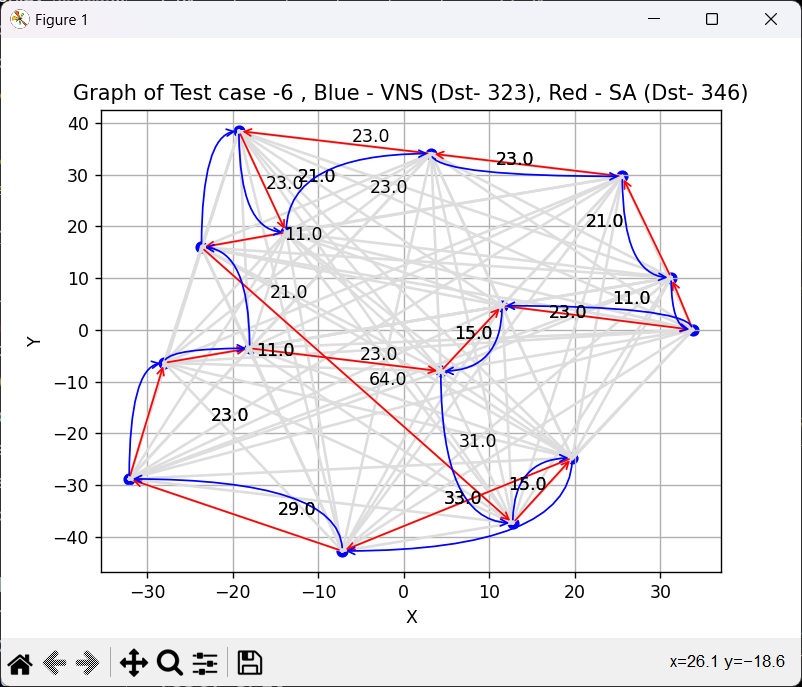

# AI Assignment

# Variable Neighborhood Search (VNS) for Traveling Salesman Problem

VNS for TSP is present VNS_TSP folder
This repository provides an implementation of the Variable Neighborhood Search (VNS) algorithm to solve the Traveling Salesman Problem (TSP) using 2-opt, 3-opt and 4-opt techniques.

## Requirements

- Python 3
- numpy

## Features

1. **Local Search**: Uses 2-opt , 3-opt or 4-opt technique to find a better tour by locally optimizing the given tour.
2. **VNS Algorithm**: Main algorithm that Tries different neighbourhood functions to reach optimal point and local search steps.
3. **Benchmark Testing**: Loads the benchmark dataset from `benchmark_dataset/optimal_solutions.json` and evaluates the VNS algorithm's performance on them.

## Usage

1. Ensure the benchmark dataset files (`.txt` format) are present in the `benchmark_dataset` directory.
2. Make sure that `optimal_solutions.json` contains the optimal solutions for the respective TSP instances.
3. Run the main script to execute the VNS algorithm on the benchmark dataset. The results will be printed to the console and also saved in `VNS_TSP/logs/results.json`.

```bash
python tsp.py
```

## Output

After running the script, the following metrics are provided for each test:

- Test number
- Number of cities
- Total distance obtained using VNS
- Optimal distance (from benchmark)
- Score (calculated based on how close the obtained solution is to the optimal one)
- Tour
- Distance Array
  Finally, the average score across all tests is also printed.

# Simulated Annealing (SA) for Traveling Salesman Problem

SA for TSP is present in Simulated_Annealing folder
This repository provides an implementation of the Simulated Annealing algorithm to solve the Traveling Salesman Problem (TSP) using 2-opt, 3-opt and 4-opt techniques.

## Requirements

- Python 3
- numpy

## Features

1. **Neighbourhood Function**: Uses 2-opt technique to find a better tour by locally optimizing the given tour.
2. **Simulated Annealing Algorithm**: Main algorithm that balances exploitation and exploration.
3. **Benchmark Testing**: Loads the benchmark dataset from `benchmark_dataset/optimal_solutions.json` and evaluates the VNS algorithm's performance on them.

## Usage

1. Ensure the benchmark dataset files (`.txt` format) are present in the `benchmark_dataset` directory.
2. Make sure that `optimal_solutions.json` contains the optimal solutions for the respective TSP instances.
3. Run the main script to execute the VNS algorithm on the benchmark dataset. The results will be printed to the console and also saved in `Simulated_Annealing/logs/results.json`.

```bash
python tsp.py
```

## Output

After running the script, the following metrics are provided for each test:

- Test number
- Number of cities
- Total distance obtained using VNS
- Optimal distance (from benchmark)
- Score (calculated based on how close the obtained solution is to the optimal one)
- Tour
- Distance Array

Finally, the average score across all tests is also printed.

## A Sample Test


